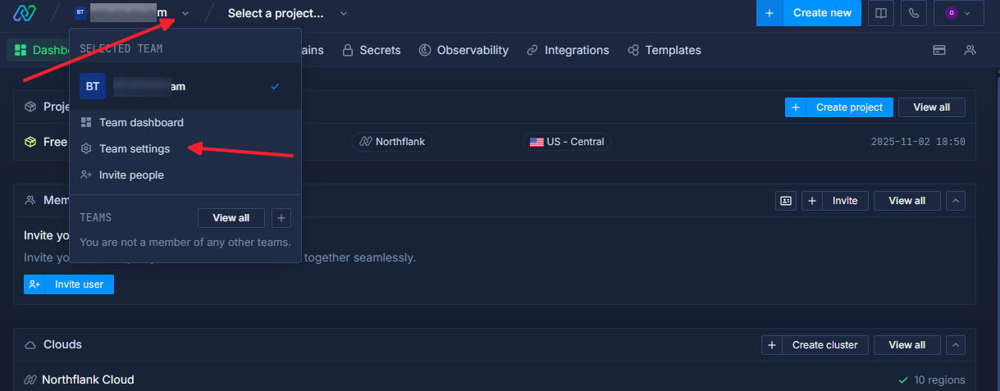
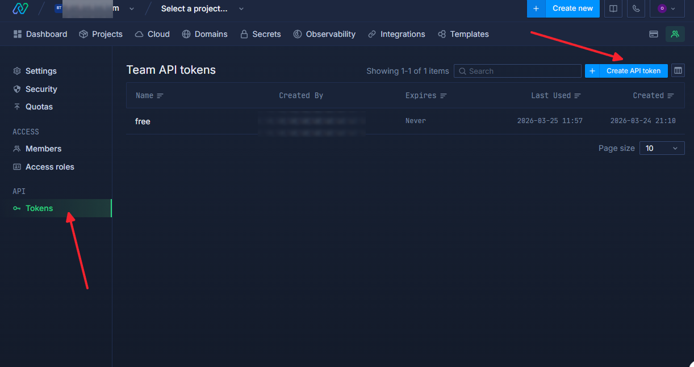
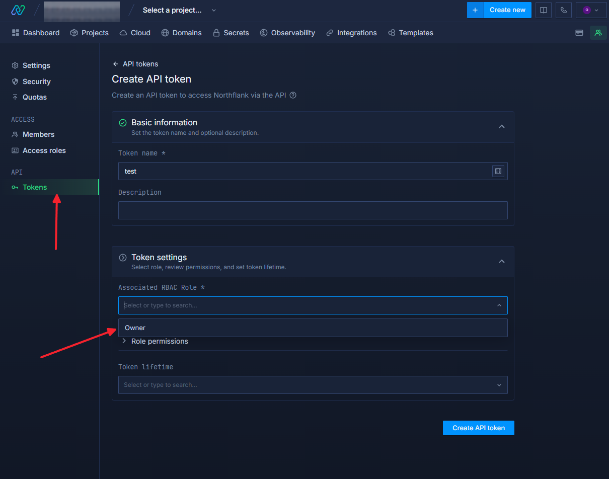

<div align="center">
  <h1>Northflank 外部镜像自动刷新</h1>
  <p>定时调用 Northflank API 重启外部镜像 service，自动拉取 Docker Hub 最新版本</p>
  <p>简体中文 | <a href="README.en.md">English</a></p>
  <p>
    
    
    
    
  </p>
</div>

> 只需 3 分钟部署，之后定时自动重启你的 Northflank service，使其重新拉取外部镜像的最新版本。

## 3 分钟部署

### 第 0 步：创建 Northflank API Token

打开：

- https://app.northflank.com

创建一个 API Token，设置好权限。后面把它填到 GitHub 的 `NF_API_TOKEN` 里。

获取 `NF_API_TOKEN` 的步骤参考截图：







### 第 1 步：用 GitHub Importer 转为私有仓库

1. 登录 GitHub，打开 https://github.com/new/import
2. 按以下信息填写：

| 字段 | 填什么 |
| --- | --- |
| `Your old repository's clone URL` | `https://github.com/OUBIGFA/Northflank-Refresh-External-Image` |
| `Owner` | 你的 GitHub 账号 |
| `Repository name` | 你的仓库名，例如 `my-northflank-refresh` |
| `Privacy` | 选 `Private` |

1. 点击 `Begin import`，等待导入完成（通常几十秒到几分钟）
2. 导入完成后你就拥有一个属于自己的私有仓库，后续的 Secret 和 workflow 都在这个仓库里设置

### 第 2 步：修改 workflow 里的 project ID 和 service ID

打开：

- `.github/workflows/northflank-refresh-external-image.yml`

你会看到这个示例地址：

```text
https://api.northflank.com/v1/projects/a86/services/b94/restart
```

含义：

- `a86` = 示例 `project ID`
- `b94` = 示例 `service ID`

把它们换成你自己的值。

### 第 3 步：添加 GitHub Secret 并手动运行一次

进入：

- `Settings -> Secrets and variables -> Actions`

添加 Secret：

- `NF_API_TOKEN`

然后打开 `Actions`，手动运行一次 `northflank-image-Update`，确认你的 service 被成功重启。

## 你真正要改的只有 3 处

1. 你的 `project ID`
2. 你的 `service ID`
3. 你的 `NF_API_TOKEN`

其他内容基本不用动。

## 完整示例

```text
https://api.northflank.com/v1/projects/a86/services/b94/restart
```

- `a86` 是示例 `project ID`
- `b94` 是示例 `service ID`

部署时一定要换成你自己的真实值。

## 为什么这个方法能更新镜像

前提条件：

- 你的 Northflank service 已配置为 `External image`
- 你的镜像 tag 使用的是 `latest`

workflow 会调用 `restart` 接口。service 重启时 Northflank 会重新拉取外部镜像，从而拿到最新版本。

## 如果你的镜像不是 latest

如果你使用固定 tag，例如：

```text
my-image:1.2.3
```

重启后仍然会是这个固定版本，不会自动变成新版本。此方案更适合 `latest` 这类滚动更新的标签。

## 修改定时执行时间

编辑 `.github/workflows/northflank-refresh-external-image.yml` 中的 `cron`：

```yaml
schedule:
  - cron: "17 4 * * 2"
```

表示：

- 每周二
- 04:17 UTC

## 官方文档

- [Run an image from a container registry](https://northflank.com/docs/v1/application/run/run-an-image-from-a-container-registry)
- [Manage CI/CD](https://northflank.com/docs/v1/application/release/manage-ci-cd)
- [Restart service API](https://northflank.com/docs/v1/api/project/services/restart-service)

## 许可证

本项目使用 MIT License。

